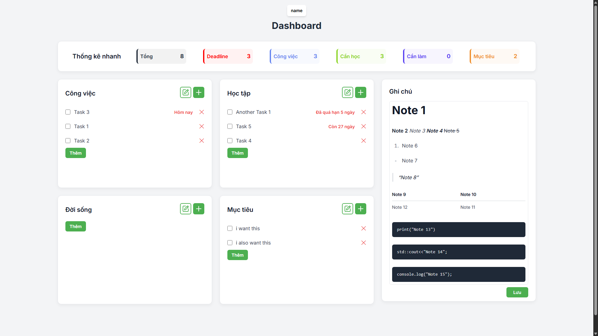
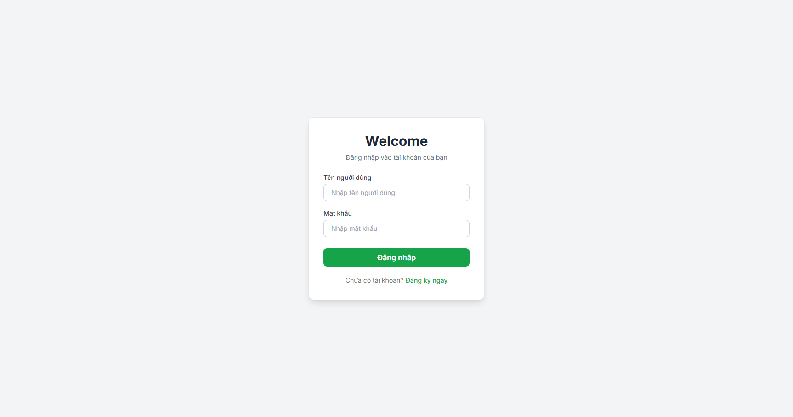
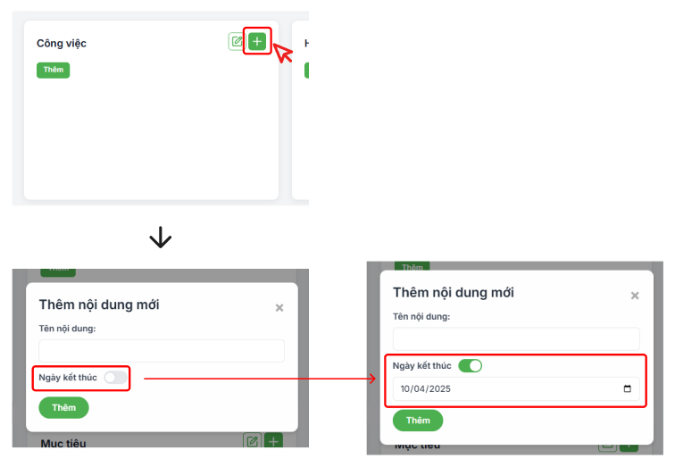
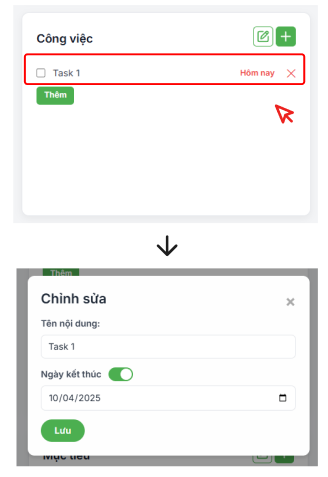
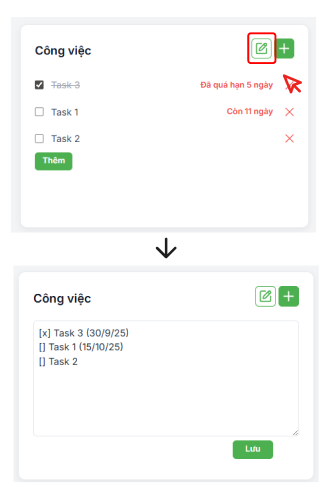
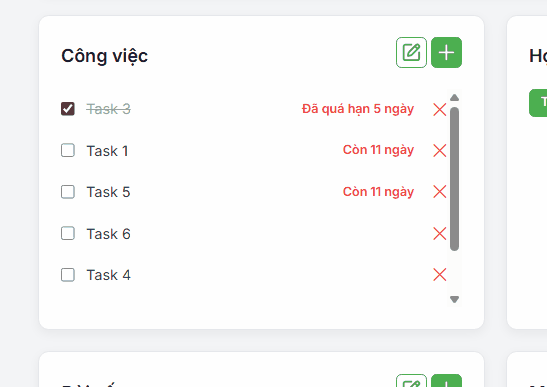
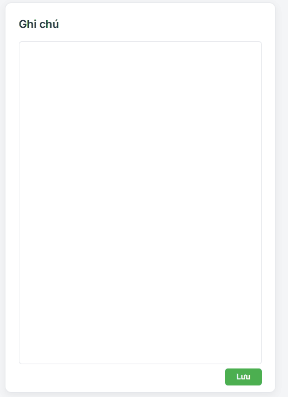

# myDashboard

Web app quản lý task & deadline với giao diện trực quan, hỗ trợ cloud storage và markdown notes.

  
*(Giao diện chính)*  

---

## Giới thiệu  
**myDashboard** là một ứng dụng web dạng **to-do list /task manager** với thiết kế trực quan, dễ sử dụng. Người dùng có thể:  
- Tạo, chỉnh sửa, xóa, đánh dấu hoàn thành Task  
- Thống kê tiến độ công việc, kiểm tra deadline.
- Ghi chú các thông tin quan trọng.
- Có thể truy cập ở bất cứ đâu (mobile/ desktop).
- Giao diện responsive, hoạt động tốt trên cả desktop và mobile  

---

## Tính năng chính  
- Tạo, chỉnh sửa, xóa Task.
- Hỗ trợ chỉnh sửa task dưới dạng raw text.
- Sắp xếp task theo deadline
- Kéo, thả để sắp xếp task (có cùng deadline).
- Lưu trữ trên dữ liệu trên cloud.
- Ghi chú hỗ trợ markdown syntax cơ bản.

---

## Tech Stack  
- **Frontend**: HTML, CSS, JavaScript  
- **Backend**: Node.js  
- **Database**: MySQL

---

## Hướng dẫn chi tiết

- **Tạo tài khoản bằng username và password để bắt đầu**


- **Đăng nhập bằng tài khoản vừa tạo**



- **Tạo task**



- **Sửa task**



- **Chỉnh sửa task dưới dạng raw text**

    ```
    // syntax:
    [] Ten (dd/mm/yy)
    ```


- **Kéo thả task**



- **Tạo ghi chú (có hỗ trợ markdown syntax cơ bản)**




---

## Mục đích

> **Project này được tạo ra với mục đích giúp người dùng có thể quan sát, theo dõi, thống kê tiến độ các công việc của mình từ đó cải thiện hiệu suất công việc.**

> *Ngoài ra đây cũng là project showcase, tập trung vào kỹ năng frontend, backend và database cơ bản.*

---

## Author
* **Author**: **[b1nhan](https://github.com/b1nhan)**

---

## Acknowledgements

* **ChadBot**: *[CheatGPT](https://chatgpt.com)*, *[GemiNice](https://gemini.google.com)*, *[Clonede](https://claude.ai)*


---

> *Hope you enjoy <3*