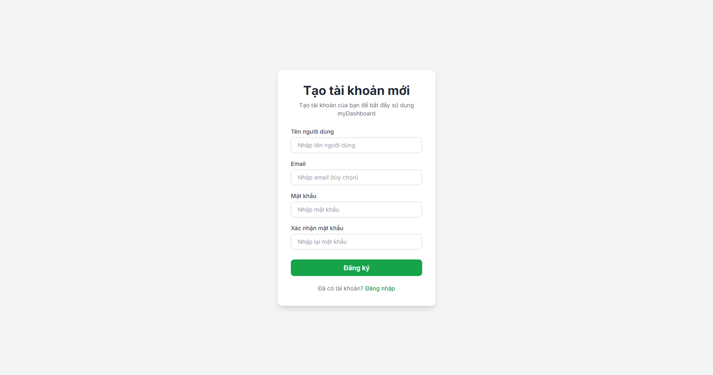

# myDashboard

## Giới thiệu  
**myDashboard** là một ứng dụng web dạng **to-do list /task manager** với thiết kế trực quan, dễ sử dụng. Có tính năng chỉnh sửa [task raw text](#chỉnh-sửa-task-dưới-dạng-raw-text), hỗ trợ [markdown syntax](#tạo-ghi-chú-có-hỗ-trợ-markdown-syntax-cơ-bản), cloud storage và [các tính năng khác](#tính-năng-chính)

  
*(Giao diện chính)*  

## Tính năng chính 
- Tạo, chỉnh sửa, xóa Task.
- Hỗ trợ chỉnh sửa task dưới dạng raw text.
- Sắp xếp task theo deadline
- Kéo, thả để sắp xếp task (có cùng deadline).
- Ghi chú hỗ trợ markdown syntax cơ bản.
- Có hỗ trợ tạo/ đăng nhập tài khoản.
- Lưu trữ dữ liệu trên cloud.

## Truy cập và sử dụng

**[Website](https://my-dashboard-b1nhan.vercel.app)**: https://my-dashboard-b1nhan.vercel.app

## Hướng dẫn chi tiết

- ### Tạo tài khoản bằng username và password để bắt đầu



- ### Đăng nhập bằng tài khoản vừa tạo


- ### Tạo task


- ### Sửa task


- ### Chỉnh sửa task dưới dạng raw text

    ```
    // syntax:
    [] Ten (dd/mm/yy) //Chưa hoàn thành
    [x] Ten (dd/mm/yy) //Hoàn thành
    ```


- ### Kéo thả task (chỉ áp dụng với task có cùng deadline)


- ### Tạo ghi chú (có hỗ trợ markdown syntax cơ bản)


## Author
* **Author**: **[b1nhan](https://github.com/b1nhan)**


## Acknowledgements

* **ChadBot**: *[CheatGPT](https://chatgpt.com)*, *[GemiNice](https://gemini.google.com)*, *[Clonede](https://claude.ai)*


> *Hope you enjoy <3*